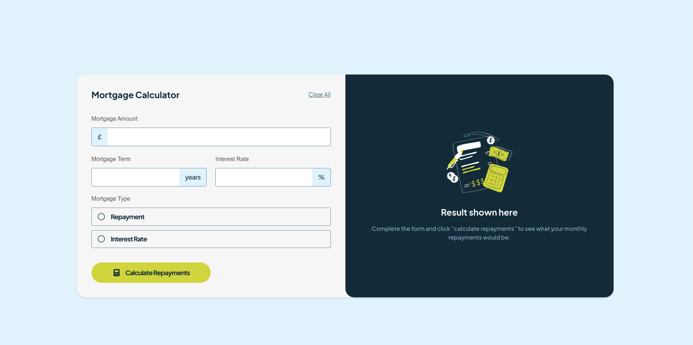

# Frontend Mentor - Mortgage repayment calculator solution

This is a solution to the [Mortgage repayment calculator challenge on Frontend Mentor](https://www.frontendmentor.io/challenges/mortgage-repayment-calculator-Galx1LXK73). Frontend Mentor challenges help you improve your coding skills by building realistic projects.

## Table of contents

- [Overview](#overview)
  - [The challenge](#the-challenge)
  - [Screenshot](#screenshot)
  - [Links](#links)
- [My process](#my-process)
  - [Built with](#built-with)
  - [Useful resources](#useful-resources)
- [Author](#author)
- [Acknowledgments](#acknowledgments)

## Overview

### The challenge

Users should be able to:

- Input mortgage information and see monthly repayment and total repayment amounts after submitting the form
- See form validation messages if any field is incomplete
- Complete the form only using their keyboard
- View the optimal layout for the interface depending on their device's screen size
- See hover and focus states for all interactive elements on the page

### Screenshot

### Links

- Live Site URL: [Add live site URL here](https://mortgage-react-calculator-project.netlify.app/)

### Built with

- Semantic HTML5 markup
- CSS custom properties
- Flexbox
- Mobile-first workflow
- [React](https://reactjs.org/) - JS library

### Useful resources

- [Geeksforgeeks React hooks](https://www.geeksforgeeks.org/reactjs-hooks/) - This helped me regarding for React Hooks.
- [MDN radio button](https://developer.mozilla.org/en-US/docs/Web/HTML/Element/input/radio) - This article helped me with radio button.

## Author

- Github - [@muzuncavdar](https://github.com/muzuncavdar)
- Frontend Mentor - [@muzuncavdar](https://www.frontendmentor.io/profile/muzuncavdar)
- Twitter - [@merdolike](https://www.twitter.com/merdolike)
